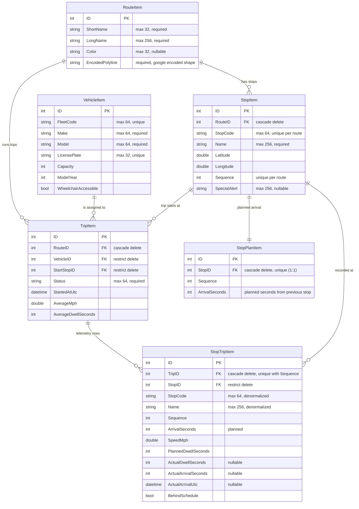

# gmvTM — Time and Motion

A small transit "time and motion" study. It seeds LA DASH Route F (stops, planned times, route shape) into SQLite, exposes a versioned JSON API plus OData, and simulates a bus driving the route in real time: positions stream to the browser over a websocket, a map shows the vehicle moving, stops announce themselves bilingually (English/Spanish), and you can ask any stop for its next planned vs. actual arrival with an on-time / late / ahead verdict. There is no fixed timetable on purpose — planned times are seconds from the previous stop, and the clock starts the moment you start a simulation.

The development synopsis (what was built when, and where AI assisted) lives in [devnotes.md](devnotes.md), written up from the raw [devnotes.txt](devnotes.txt).

**AI assistance:** Claude assisted where noted in the dev notes. On the client it sped up the React development — I scaffolded the object classes, DTOs, globals and tools in TypeScript and let Claude fill in the components around them. Claude also assisted in generating this README: I gave it my notes to spellcheck and to create the schema diagram, the Docker instructions and the setup script.

## Quick start

**Fastest way after downloading:** just run `setup.bat` in the repo root. It checks every requirement (.NET 8 SDK, Node 20+, npm, optionally Visual Studio), installs the client packages, builds the solution, starts the server, and opens the app in your browser.

| How | Steps |
|---|---|
| **Windows, one script** | Run `setup.bat` — checks all requirements, installs client packages, builds, runs, opens the browser |
| **Visual Studio 2022** | Open `gmvTM.sln`, set **gmvTM.Server** as startup, press **F5** (https profile) |
| **CLI** | `dotnet run --project gmvTM.Server --launch-profile https` (Vite is started automatically by the SPA proxy) |
| **Docker (Linux container)** | `docker compose up --build`, then open [http://localhost:8080/route/f](http://localhost:8080/route/f) |

App: [http://localhost:5173/route/f](http://localhost:5173/route/f) (dev) · Swagger: `/swagger` · Credentials: `ladot` / `dieengele`

## Requirements

| Requirement | Notes |
|---|---|
| Visual Studio 2022 (17.8+) | With the **ASP.NET and web development** workload (includes the JavaScript/TypeScript tools needed for the `.esproj` client project). Optional — the CLI, `setup.bat`, and Docker paths work without it |
| .NET SDK 8.0.x | Any 8.0 feature band; installed with VS 2022 17.8+. `global.json` accepts any 8.0.100+ SDK |
| Node.js 20+ (LTS) with npm | Runs the Vite dev server and builds the client; install from [nodejs.org](https://nodejs.org/) and restart Visual Studio so it picks up PATH |
| Docker Desktop (optional) | Only for the container path; the image is a **Linux** container, so keep Docker Desktop in Linux-containers mode |
| Internet access on first build | NuGet restores packages (including the JavaScript MSBuild SDK for the client project) and npm installs client dependencies |

First build conveniences:

- `npm install` for `gmvTM.Client` runs automatically on the first Debug build if `node_modules` is missing.
- If Node.js is not installed, the build fails with an explicit error telling you to install it (instead of the SPA proxy silently failing at runtime).
- The SQLite database `gmvtm.db` is created and seeded automatically on first run.
- `setup.bat` performs all of these checks up front (SDK 8, Node 20+, npm, optionally VS 2022) and then builds and runs.

## Run with Docker (Linux container)

The image is a three-stage Linux build: `node:20-alpine` builds the React client, `dotnet/sdk:8.0` publishes the API (the client `dist` is picked up into `wwwroot` by the publish target), and the app runs on `dotnet/aspnet:8.0`.

```bash
docker compose up --build
```

Then open [http://localhost:8080/route/f](http://localhost:8080/route/f). Swagger is at [http://localhost:8080/swagger](http://localhost:8080/swagger) (the compose file runs the container in the Development environment so Swagger is on for the demo).

Details:

- The SQLite database lives on a named volume (`gmvtm-data`, mounted at `/data`), so data survives container restarts. `docker compose down -v` wipes it and the next start reseeds.
- In the container there is no Vite: the server serves the built client itself from `wwwroot` and falls back to `index.html`, so app, API, OData, and the websocket hub are all same-origin on port 8080.
- Build without compose: `docker build -t gmvtm .` then `docker run -p 8080:8080 gmvtm`.

## How the client talks to the API

**Development (F5 / CLI):** the server runs on `https://localhost:7080`, and the SPA proxy (`Microsoft.AspNetCore.SpaProxy`) starts the Vite dev server on `http://localhost:5173` and sends your browser there. The client only ever uses relative URLs (`/api/v1/...`, `/odata/...`, `/hubs/...`); `vite.config.ts` proxies those three prefixes straight to `https://localhost:7080` (`secure: false` accepts the self-signed dev certificate, `ws: true` upgrades the SignalR websocket). Proxying directly to the HTTPS port matters: proxying to the HTTP port would trigger the server's HTTPS redirect, and browsers strip the `Authorization` header on cross-origin redirects, which turns every authenticated call into a 401.

**Production / Docker:** the published client is served by the API itself from `wwwroot`, so the same relative URLs hit the same origin and no proxy is involved.

**Auth:** all `/api` and `/odata` calls require HTTP Basic authentication (small exam project — one username, no claims or roles). The client attaches the header itself; in Swagger click **Authorize**. The password is stored in `appsettings.json` only as a SHA-256 hash.

## Data model

All persistable types inherit `BaseItem` (integer `ID` primary key); the schema below is generated by reflection from `[TableDefinition]` attributes on the items — adding a new `BaseItem` is enough for it to land in the database.



In words: a route owns its stops (ordered by `Sequence`) and its shape as an encoded polyline. `StopPlanItem` is the plan — seconds from the previous stop at the baseline speed. Starting a simulation creates a `TripItem` (route + vehicle + start stop + speed/dwell settings) with one `StopTripItem` per stop, and the telemetry (actual arrival, actual dwell, behind-schedule flag) is written into those rows as the simulated bus drives.

## Core flow

1. Open `/route/{code}` (default **`/route/f`**)
2. API is always route-scoped — e.g. `GET /api/v1/routes/{code}/stops`, `.../arrivals/next`
3. App starts one simulated trip for that route at **current time** with the selected MPH and seconds-at-stop
4. **Apply & restart** begins again from the selected stop at now

## API (versioned, route-parameterized)

The API uses URL-segment versioning (`Asp.Versioning`); the current version is **v1** and responses include `api-supported-versions` headers.

All `/api` and `/odata` calls require HTTP Basic authentication. Credentials: username `ladot`, password `dieengele`.

| Method | Path |
|---|---|
| GET | `/api/v1/routes` |
| GET | `/api/v1/routes/{routeCode}` |
| GET | `/api/v1/routes/{routeCode}/shape` |
| GET | `/api/v1/routes/{routeCode}/vehicles` |
| GET | `/api/v1/vehicles` |
| GET | `/api/v1/routes/{routeCode}/stops` |
| GET | `/api/v1/routes/{routeCode}/stops/{stopCode}` |
| GET | `/api/v1/routes/{routeCode}/stops/{stopCode}/arrivals/next` |
| POST | `/api/v1/routes/{routeCode}/simulations` |
| GET | `/api/v1/simulations` |
| DELETE | `/api/v1/simulations/{id}` |
| POST | `/api/v1/admin/database/reseed` |
| GET | `/odata/{RouteItems\|StopItems\|VehicleItems\|TripItems\|StopPlanItems\|StopTripItems}` |
| WS | `/hubs/vehicle/{fleetCodes}` (SignalR, comma-separated fleet codes to monitor) |

The OData endpoints support `$filter`, `$select`, `$orderby`, `$count`, `$expand`, and `$top` (max 200) — e.g. `GET /odata/StopItems?$filter=Sequence gt 5&$orderby=Sequence&$select=StopCode,Name`. The reseed endpoint stops any active simulation, clears every table, and reseeds from `route-f-seed.json`.

`F` is only the default UI route — adding another `Route` + trips in SQLite is enough for `/route/{code}` to work.

## Observability

- **Logging** — Serilog with structured request logging (`UseSerilogRequestLogging`), per-endpoint application logs in the controllers, and simulation lifecycle logs. Sinks: console + rolling daily files under `gmvTM.Server/logs/` (14 days retained). Levels are configured in `appsettings.json` (`Serilog` section); Development raises the default to `Debug`.
- **Prometheus metrics** — `GET /metrics` (prometheus-net) exposes standard ASP.NET Core HTTP metrics plus custom metrics: `gmvtm_simulations_started_total` / `gmvtm_simulations_stopped_total` (counters, started is labeled by route), `gmvtm_simulations_active` (gauge, refreshed every simulation tick), and `gmvtm_next_arrival_requests_total` (counter labeled by route). Point a Prometheus scrape job at `/metrics` on the server port.
- **Developer console** — on Debug/Development runs on Windows, a separate console window opens listing all endpoints (Swagger, API, OData, Prometheus, hub) so you never have to hunt for URLs.

## Architecture

| Project | Role |
|---|---|
| `gmvTM.Domain` | Items, collections, workers, EF Core strategy (`Strategies/ORM/EFCore`), extensions |
| `gmvTM.Application` | Services, simulation orchestration, tools, DI |
| `gmvTM.Server` | Controllers (REST + OData), SignalR hub, middleware, composition root |
| `gmvTM.Client` | React + TypeScript + Vite + Chakra + Leaflet (`dtos/`, `globals/`, `tools/`) |

Projects sit next to each other at the repo root (no `src/` folder for Domain/Application).

Domain layout:
- `Items/{Base,Interfaces,View}` + concrete items
- `Collections/{Base,Interfaces,View}` + concrete collections
- `Strategies/ORM/EFCore/` (collections, workers, unit of work, DbContext — DI is scoped by an `ORMType` enum so another ORM can be slotted in)
- `Workers/` (+ `Workers/Interfaces`)
- `Extensions/{Items,Collections}`
- `Classes/` (`DTOs`, `Enums`, `Structs`, `Factories`, `Tools`, `Singletons` — constants are exposed via `gmvDomain.*`)

Persistable: `BaseItem` / `BaseCollection` with sync+async CRUD (`Create`/`Read`/`Update`/`Delete` and `*Items` bulk APIs).
Non-DB: `ViewItem` / `ViewCollection` (e.g. `CoordinatesViewItem`, `RoutePathViewItem`).

## Assessment coverage

| Requirement | Where |
|---|---|
| .NET web app (API + site, one solution) | `gmvTM.sln` → `gmvTM.Server` + `gmvTM.Client` |
| SQLite DB, init once, reuse later | EF Core + `gmvtm.db`, `DataSeederWorker` |
| Route F stops + scheduled times (normalized) | `RouteItem` / `StopItem` / `StopPlanItem` |
| Live simulation telemetry | `TripItem` / `StopTripItem` (speed, dwell, schedule miss) |
| JSON API | `/api/v1/routes/...` (see API table) |
| Minimal UX: choose stop → next time | React client at `/route/f` |
| Unit + integration tests | `tests/*` |
| IDE runnable | VS2022 F5 / `dotnet run` + Vite / `setup.bat` / Docker |

## Troubleshooting

**"The application which this project type is based on was not found" for `gmvTM.Client.esproj`** — the `.esproj` client project uses Visual Studio's JavaScript Project System, which ships with the **ASP.NET and web development** workload. Open the Visual Studio Installer, select **Modify**, tick that workload, and update to a recent VS 2022 (17.8+). Until then the client project simply stays unloaded — everything still runs, because the server launches the Vite dev server itself on F5, and the `setup.bat`, CLI, and Docker paths don't use the `.esproj` at all.

**"Version 8.0.x of the .NET SDK requires at least version 17.8.3 of MSBuild. The current available version of MSBuild is 16.x"** — the solution was opened in Visual Studio 2019 (MSBuild 16 is VS 2019). .NET 8 projects cannot be built by VS 2019 at all, and no `global.json` change can fix that — despite what the error suggests. Open the solution in **Visual Studio 2022 (17.8+)** instead; if both versions are installed, right-click the `.sln` → **Open with** → Visual Studio 2022, or set VS 2022 as the default handler for `.sln` files. The `setup.bat`, CLI, and Docker paths only need the .NET 8 SDK, not Visual Studio.

**Client fails with "Node.js is required..." on first Debug build** — install the Node LTS from [nodejs.org](https://nodejs.org/) and restart Visual Studio so it picks up the new PATH.

**401s from the API in dev** — make sure the Vite proxy targets the HTTPS port (it does by default); proxying to the HTTP port causes a redirect that strips the Authorization header.

## Build & test

```bash
dotnet build gmvTM.sln
dotnet test gmvTM.sln
cd gmvTM.Client && npm install && npm run build
```

For production publish, build the client first (`npm run build`); the server copies `gmvTM.Client/dist` into `wwwroot` during publish when present (this is exactly what the Dockerfile does).
